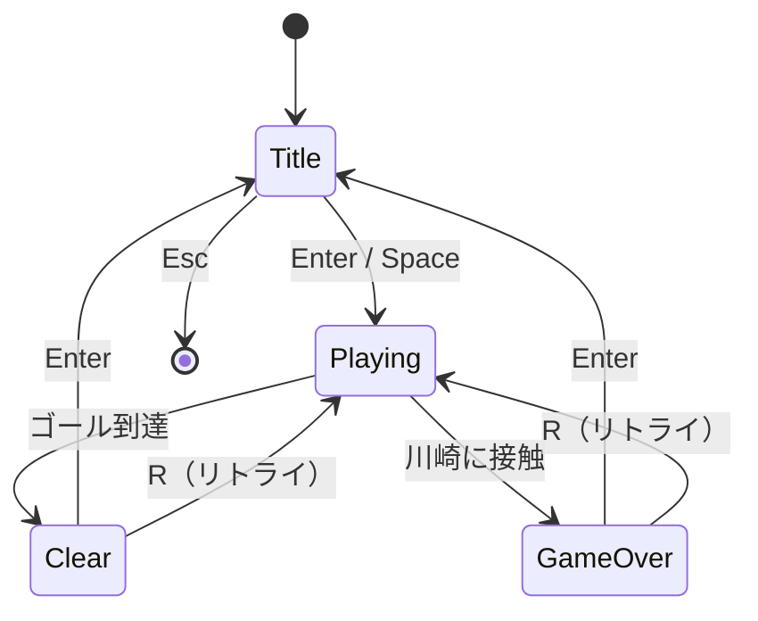

# 川崎鬼ごっこ2 — 設計書

## 1. 概要

| 項目 | 内容 |
|------|------|
| ゲーム名 | 川崎鬼ごっこ2 |
| ジャンル | 2D トップダウン迷路アクション |
| 技術 | Python 3.10+ / Pygame 2.x |
| 目的 | ランダム生成された迷路でゴールに到達する。川崎に捕まらないこと |

プレイヤーは迷路内を移動し、ゴールを目指す。敵キャラクター「川崎」が A* 経路探索で追跡する。ゴール到達でクリア、接触でゲームオーバー。

---

## 2. ゲームフロー



---

## 3. 画面仕様

### 3.1 タイトル画面 (`TitleScreen`)

- ゲーム名「川崎鬼ごっこ2」を表示
- 操作説明（移動キー、スタート方法）
- ハイスコア（最速クリアタイム）を表示
- **Enter / Space** → ゲーム開始
- **Esc** → 終了

### 3.2 ゲーム画面 (`GameScreen`)

- 迷路・プレイヤー・川崎・ゴールを描画
- HUD: 経過時間、ハイスコア
- **Esc** → タイトルに戻る（プレイ中断）

### 3.3 クリア画面 (`ClearScreen`)

- 「CLEAR!」表示
- クリアタイム表示
- ハイスコア更新時は「NEW RECORD!」表示
- **Enter** → タイトルへ
- **R** → 即リトライ（新迷路生成）

### 3.4 ゲームオーバー画面 (`GameOverScreen`)

- 「GAME OVER」表示
- 生存時間を表示
- **Enter** → タイトルへ
- **R** → 即リトライ

---

## 4. ゲームプレイ仕様

### 4.1 プレイヤー

| 項目 | 値 |
|------|-----|
| 操作 | 矢印キー または WASD |
| 移動速度 | 3 px/frame（設定で変更可） |
| 当たり判定 | タイルサイズ 32px の矩形 |
| 壁判定 | 移動前に衝突チェック、壁にめり込まない |

### 4.2 川崎（敵）

| 項目 | 値 |
|------|-----|
| 行動 | プレイヤー位置へ A* 最短経路で追跡 |
| 初期速度 | 2 px/frame |
| 速度上昇 | 30 秒ごとに +0.5、上限 5 px/frame |
| 当たり判定 | プレイヤー矩形と交差でゲームオーバー |
| 描画 | 画像があれば画像、なければ赤系矩形 |

### 4.3 迷路

| 項目 | 値 |
|------|-----|
| 生成方式 | 再帰的バックトラッキング（DFS） |
| グリッドサイズ | 21 × 15 タイル（奇数幅・奇数高さ推奨） |
| タイルサイズ | 32 px |
| 画面解像度 | 672 × 480（グリッド × タイル） |
| 壁 | グリッド値 `1`、通路 `0` |
| 配置 | プレイヤー＝迷路入口付近、川崎＝対角付近、ゴール＝最遠通路 |

### 4.4 ゴール

- 緑色のタイルまたは画像で表示
- プレイヤーが重なった瞬間クリア判定

### 4.5 スコア（ハイスコア）

| 項目 | 内容 |
|------|------|
| 記録方式 | **最速クリアタイム**（秒、小数点 2 桁） |
| 比較 | 短いほど良い。初回クリアは自動記録 |
| 保存先 | `data/highscore.json` |
| 表示 | タイトル画面・クリア画面 |

---

## 5. フォルダ構成

```
kawasakionigokko/
├── main.py                  # エントリーポイント
├── requirements.txt         # 依存パッケージ
├── DESIGN.md                # 本設計書
├── assets/
│   ├── images/              # スプライト（任意・未配置時は図形描画）
│   └── fonts/               # フォント（任意・未配置時はデフォルト）
├── data/
│   └── highscore.json       # ハイスコア永続化（自動生成）
└── src/
    ├── __init__.py
    ├── settings.py          # 定数・色・パス
    ├── game.py              # ゲーム全体・状態管理
    ├── maze.py              # 迷路生成アルゴリズム
    ├── map_data.py          # グリッド変換・衝突・A* 経路探索
    ├── player.py            # プレイヤー
    ├── enemy.py             # 川崎
    ├── goal.py              # ゴール
    ├── screens/
    │   ├── __init__.py
    │   ├── base_screen.py   # 画面基底クラス
    │   ├── title_screen.py
    │   ├── game_screen.py
    │   ├── game_over_screen.py
    │   └── clear_screen.py
    └── utils/
        ├── __init__.py
        ├── highscore.py     # JSON 読み書き
        └── sprites.py       # 画像読み込みヘルパー
```

---

## 6. モジュール責務

| ファイル | 責務 |
|----------|------|
| `main.py` | Pygame 初期化、`Game` 起動 |
| `src/settings.py` | 画面サイズ、色、速度、ファイルパス等の定数 |
| `src/game.py` | メインループ、画面状態の切り替え、イベント配信 |
| `src/maze.py` | `generate_maze(width, height) -> grid` |
| `src/map_data.py` | 座標変換、`is_wall`、`find_path`（A*） |
| `src/player.py` | 入力処理、移動、描画 |
| `src/enemy.py` | 追跡 AI、速度上昇、描画 |
| `src/goal.py` | ゴール位置・描画・到達判定 |
| `src/screens/*.py` | 各画面の `handle_event` / `update` / `draw` |
| `src/utils/highscore.py` | `load_highscore()` / `save_highscore(time)` |
| `src/utils/sprites.py` | `load_sprite(path) -> Surface \| None` |

---

## 7. クラス設計

### 7.1 `Game`

```
Game
├── screen: pygame.Surface
├── clock: pygame.time.Clock
├── current_screen: BaseScreen
├── highscore: float | None
└── run() -> None
```

画面遷移は `Game.change_screen(screen_name, **kwargs)` で行う。

### 7.2 `BaseScreen`（抽象）

```
BaseScreen
├── handle_event(event) -> str | None   # 遷移先シグナル
├── update(dt) -> None
└── draw(surface) -> None
```

遷移シグナル例: `"title"`, `"playing"`, `"clear"`, `"game_over"`, `"quit"`

### 7.3 `MapData`

```
MapData
├── grid: list[list[int]]
├── world_to_grid(pos) -> (x, y)
├── grid_to_world(grid_pos) -> (x, y)
├── is_wall(world_rect) -> bool
└── find_path(start, goal) -> list[(x,y)]
```

### 7.4 `Player` / `Enemy` / `Goal`

いずれも `rect: pygame.Rect` を持ち、`update(...)` / `draw(surface)` を実装。

---

## 8. 迷路生成アルゴリズム

1. 全セルを「壁」で初期化
2. 開始セル (1, 1) を通路にし、スタックに push
3. 未訪問の隣接セル（2 マス先）をランダム順に探索
4. 通路を掘り、スタックでバックトラック
5. 全セル処理後、外周を壁で囲む
6. プレイヤー・川崎・ゴール用のスポーン位置を通路から選定

---

## 9. A* 経路探索

- ノード: 通路タイルのみ
- ヒューリスティック: マンハッタン距離
- 川崎は毎フレーム（または数フレームごと）プレイヤー位置をターゲットに再計算
- 経路の次のタイル方向へ移動

---

## 10. データ永続化

### `data/highscore.json`

```json
{
  "best_time": 45.32,
  "updated_at": "2026-06-08T12:00:00"
}
```

- ファイルが無い場合は `best_time: null` として新規作成
- クリア時に既存記録より速ければ更新

---

## 11. 依存関係

```
pygame>=2.5.0
```

標準ライブラリ: `json`, `pathlib`, `random`, `heapq`, `datetime`

---

## 12. 実装順序（推奨）

1. `settings.py` / `sprites.py` — 定数とアセット読み込み
2. `maze.py` / `map_data.py` — 迷路生成と経路探索
3. `player.py` / `enemy.py` / `goal.py` — ゲームオブジェクト
4. `utils/highscore.py` — スコア保存
5. `screens/*.py` — 各画面
6. `game.py` / `main.py` — 統合とエントリーポイント
7. 動作確認・バランス調整

---

## 13. 将来拡張（スコープ外）

- BGM / SE
- ステージ難易度選択
- 複数の川崎
- アイテム（一時的な無敵など）
- スプライトアニメーション

---

## 14. 承認後の実装範囲

本設計書に基づき、上記フォルダ構成の全 Python ファイルを実装する。
